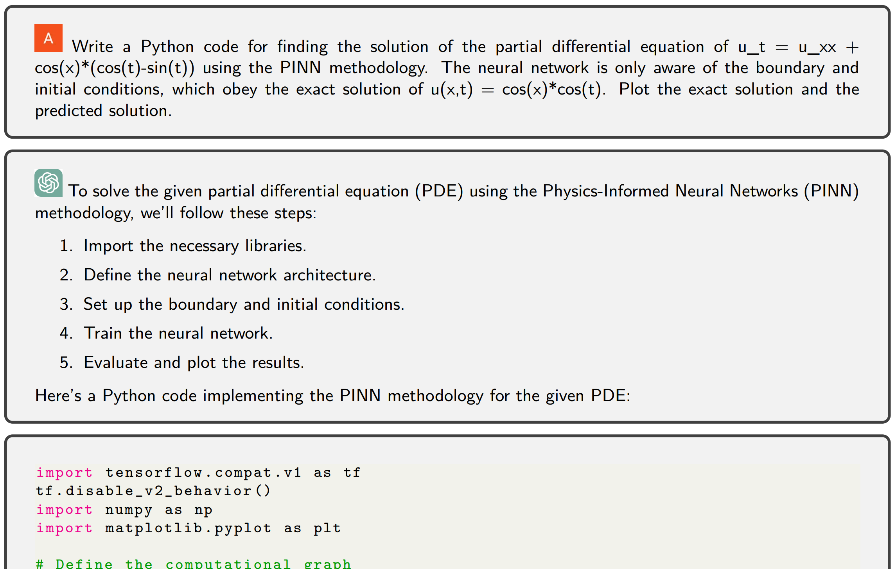

# ChatGPT for Programming Numerical Methods

**Programming numerical methods using ChatGPT: successes, failures, and challenges**

**Research Article:** 
**[ChatGPT for Programming Numerical Methods](https://www.dl.begellhouse.com/journals/558048804a15188a,498820861ef102d2,1255e053242c9a40.html)**  
This is also the **[arXiv](https://arxiv.org/pdf/2303.12093.pdf)** version.  

**Authors:** Ali Kashefi (kashefi@stanford.edu) & Tapan Mukerji (mukerji@stanford.edu) 
**Version:** 2.0  

**Citation**  
If you use this research article, please cite the following journal paper:  
**[ChatGPT for Programming Numerical Methods](https://www.dl.begellhouse.com/journals/558048804a15188a,498820861ef102d2,1255e053242c9a40.html)**

     @article{kashefi2023chatgpt,
       title={Chatgpt for programming numerical methods},
       author={Kashefi, Ali and Mukerji, Tapan},
       journal={Journal of Machine Learning for Modeling and Computing},
       volume={4},
       number={2},
       year={2023},
       publisher={Begel House Inc.}}

**Abstract**

ChatGPT is a large language model recently released  by the OpenAI company. In this technical report, we explore for the first time the capability of ChatGPT for programming numerical algorithms. Specifically, we examine the capability of GhatGPT for generating codes for numerical algorithms in different programming languages, for debugging and improving written codes by users, for completing missed parts of numerical codes, rewriting available codes in other programming languages, and for parallelizing serial codes. Additionally, we assess if ChatGPT can recognize if given codes are written by humans or machines. To reach this goal, we consider a variety of mathematical problems such as the Poisson equation, the diffusion equation, the incompressible Navier-Stokes equations, compressible inviscid flow, eigenvalue problems, solving linear systems of equations, storing sparse matrices, etc. Furthermore, we exemplify scientific machine learning such as physics-informed neural networks and convolutional neural networks with applications to computational physics. Through these examples, we investigate the successes, failures, and challenges of ChatGPT. Examples of failures are producing singular matrices, operations on arrays with incompatible sizes, programming interruption for relatively long codes, etc. Our outcomes suggest that ChatGPT can successfully program numerical algorithms in different programming languages, but certain limitations and challenges exist that require further improvement of this machine learning model.

**ChatGPT in Machine Learning + X seminar 2023 at Brown University** 
In case of your interest, you might watch the recorded machine learning seminar with the topic of ChatGPT at Brown University using the following link:  
[YouTube Video](https://www.youtube.com/watch?v=zFrZsufbNSA&t=3595s)

**Questions?**  
If you have any questions or need assistance, please do not hesitate to contact Ali Kashefi (kashefi@stanford.edu) via email.

**About the Author**  
Please see the author's website: [Ali Kashefi](https://web.stanford.edu/~kashefi/) 
